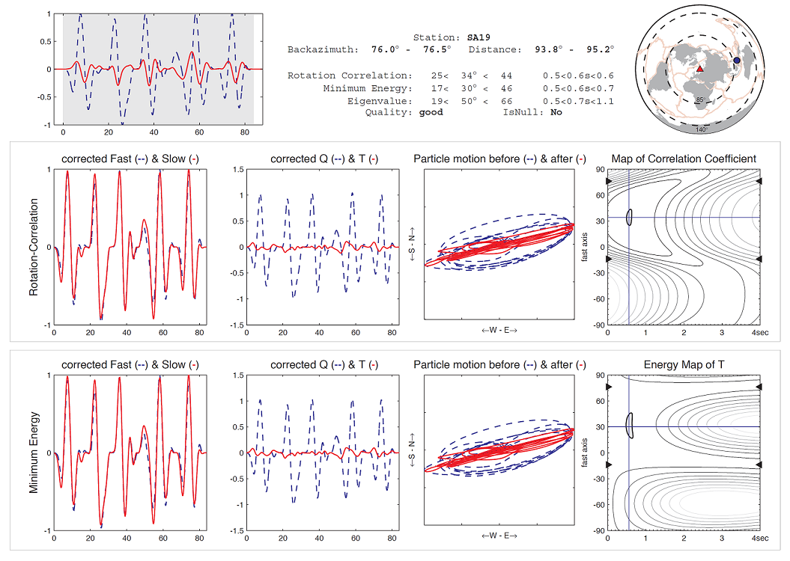

StackSplit - UserGuide
======================

December 2021 (v3.0)
January 2023 (v3.1)

Mainly written: 2021-12-23 (**Michael Grund**)
Typo fixes: 2023-01-04 (**Yvonne Fröhlich**)

Contents
--------

   * [Requirements](#requirements)
      * [License](#license)
      * [Bugs and errors](#bugs-and-errors)
      * [Miscellaneous](#miscellaneous)
   * [Installation](#installation)
   * [Running StackSplit](#running-stacksplit)
   * [Using StackSplit](#using-stacksplit)
      * [The listbox](#the-listbox)
      * [The world map](#the-world-map)
      * [The Limits panel](#the-limits-panel)
      * [The Surface stack panel](#the-surface-stack-panel)
      * [The Surface window](#the-surface-window)
      * [The Stack-Clear-Save buttons](#the-stack-clear-save-buttons)
      * [The Joint inversion panel](#the-joint-inversion-panel)
      * [The Waveforms window](#the-waveforms-window)
      * [The Inversion button](#the-inversion-button)
      * [The Exit button](#the-exit-button)
   * [Uninstall StackSplit](#uninstall-stacksplit)

Requirements
------------

StackSplit should run on every computer system on which the original [SplitLab](http://splitting.gm.univ-montp2.fr/)
package runs. Thus, MATLAB 7.0 or higher, the Mapping toolbox and for full functionality the Signal Processing
toolbox are required. If MATLAB R2014b or higher is running on your system or no license for the
Mapping toolbox is available, I recommend to use the [updated SplitLab](https://robporritt.wordpress.com/software/)
version of Rob Porritt. However, StackSplit was designed to work with both versions (with and without the Mapping
toolbox) and the installer checks which of both is stored on your system.

For details regarding the different StackSplit versions see the [Changelog](https://github.com/michaelgrund/stacksplit/blob/main/changelog.md).

For further information on SplitLab see the corresponding UserGuide that is included in the download package.

### License

StackSplit is free software: you can redistribute it and/or modify it under the terms of the GNU
General Public License as published by the Free Software Foundation, either version 3 of the
License, or (at your option) any later version.

StackSplit is distributed in the hope that it will
be useful, but WITHOUT ANY WARRANTY; without even the implied warranty of MERCHANTABILITY or
FITNESS FOR A PARTICULAR PURPOSE. See the GNU General Public License3 for more details.

### Bugs and errors

If any problems occur while installing/running StackSplit (especially due to MATLAB version issues)
or you found a potential bug, please feel free to open a new [issue](https://github.com/michaelgrund/stacksplit/issues) or
[pull request](https://github.com/michaelgrund/stacksplit/pulls) here on GitHub. Please indicate the corresponding function
that generates the error and/or copy/paste the whole error message output of MATLAB. If StackSplit does not fulfill your
expectations, don't hesitate to provide comments and suggestions for improvements etc.

### Miscellaneous

For updates of the StackSplit package, please have a look on the [GitHub repo](https://github.com/michaelgrund/stacksplit)
or the [MATLAB exchange](https://de.mathworks.com/matlabcentral/fileexchange/62402) server. The latter one mirrors the GitHub repo.

If you make use of StackSplit please acknowledge the following contributing papers:

**Software overall:**

* **_Grund, M. (2017)_**, StackSplit - a plugin for multi-event shear wave splitting analyses in SplitLab, *Computers & Geosciences*, 105, 43-50, https://doi.org/10.1016/j.cageo.2017.04.015.

* **_Wüstefeld, A., Bokelmann, G., Zaroli, C., Barruol, G. (2008)_**, SplitLab: A shear-wave splitting environment in Matlab, *Computers & Geosciences* 34, 515–528, https://doi.org/10.1016/j.cageo.2007.08.002.

**Methods (depending on your use-case and selections):**

* **_Bowman, J. & Ando. M (1987)_**, Shear-wave splitting in the upper-mantle wedge above the Tonga subduction zone, *Geophys. J. Roy. Astron. Soc*. 88, 2541, https://doi.org/10.1111/j.1365-246X.1987.tb01367.x.
* **_Restivo, A. & Helffrich, G. (1999)_**, Teleseismic shear wave splitting measurements in noisy environments, *Geophysical Journal International* 137, 821-830, https://doi.org/10.1046/j.1365-246x.1999.00845.x.
* **_Roy, C., Winter, A., Ritter, J. R. R., Schweitzer, J. (2017)_**, On the improvement of SKS splitting measurements by the simultaneous inversion of multiple waveforms (SIMW), *Geophysical Journal International*, 208, 1508-1523, https://doi.org/10.1093/gji/ggw470.
* **_Silver, P. G. & Chan, W. W. (1991)_**, Shear wave splitting and subcontinental mantle deformation. *Journal of Geophysical Research*, 96, 16429-16454, https://doi.org/10.1029/91JB00899.
* **_Wolfe, C. J. & Silver, P. G. (1998)_**, Seismic anisotropy of oceanic upper mantle: Shear wave splitting methodologies and observations, *Journal of Geophysical Research* 103(B1), 749-771, https://doi.org/10.1029/97JB02023.
* **_Wüstefeld, A. (2007)_**, Methods and applications of shear wave splitting: The East European Craton. Ph.D. thesis, *Univ. de Montpellier*, France, http://splitting.gm.univ-montp2.fr/.

Installation
------------

1. After unzipping the downloaded/cloned StackSplit package, please copy the whole StackSplit folder into SplitLab's main
folder where the file ``install_SplitLab.m`` is located. To find the path to this folder you can use the command:
```
folderSL = fileparts(which('install_SplitLab.m'))
```
2. Please add the following folder to your MATLAB search path (for editing the path simply use the command ``pathtool``):
```
SplitLabX.X.X/StackSplit
```
3. Change to the StackSplit folder in the SplitLab main directory:
```
cd([folderSL '/StackSplit'])
```
4. Inside MATLAB's command window type:
```
install_StackSplit
```
5. Restart MATLAB.

Running StackSplit
------------------

Since StackSplit expects several struct fields from different modified SplitLab functions, the plugin
is only applicable if you create a new project after installation. For old projects, analyzed
before installing StackSplit, it’s not possible to perform the different stacking procedures! Sorry!
Once you installed the StackSplit package, run SplitLab as before via ``splitlab`` in the command
window. On the left side panel now a new push button **Stacking** is available at the lowermost
position (**Fig. 1**).


***Fig. 1:** StackSplit workflow with main features/processing steps. Boxes colored in gray are essential, white ones
indicate optional settings.*

If no saved results of single event measurements are available for the current project, of course also no
stacking is possible at this point. Before stacking single measurement results, you have to analyze your
event waveforms in SplitLab as before:

1. Click button **View Seismograms**
2. Select a time window around a specific phase
3. Press the enter key to start the inversion
4. Check the diagnostics
5. Discard the result or save it

If you now save a result, several new struct fields are created for the current event. For example
the currently shown error maps, the cut waveforms of all components, the degrees of freedom etc.
For each single station project they are all saved in a mat-file named ``STANAME_eqresults.mat``.
At this point, thanks to Rob Porritt for initializing this variable in his updated SplitLab version.
To check your single results like before you can browse through the well-known options of SplitLab.
Additionally, now you can select the **Stacking** button in the main panel. If more than one single
event measurement was saved before, a new graphical user interface (GUI) will open (**Fig. 2**).


***Fig. 2**: Graphical user interface of StackSplit for two different approaches. Top panel shows an example of five
stacked minimum energy surfaces using the WS method. Bottom panel shows the concatenated waveforms for the
same five events when SIMW is selected. Numbers highlighted with colors correspond to the module descriptions in
the following section. Orange indicates modules that are available if a stacking method (no weight, WS, or RH)
is selected, blue ones belong to SIMW. The red ones are available for both approaches (surface stacking and SIMW).*

#### Additional remark
After running StackSplit the first time, please check if the single listbox entries are aligned below
their corresponding headlines, otherwise please open file ``SS_basic_settings.m`` and adjust the
fontsize of the listbox entries in the upper part of the function for your needs.

Using StackSplit
----------------

From the StackSplit main window you can manage your whole multi-event processing (see also
workflow in **Fig. 1**). The possible options and structures in this window are briefly described in
the following subsections (please note also the references to **Fig. 2**).

### The listbox

**(1)** in **Fig. 2**: Lists all available single event measurements for the current station project.
If you did more than one measurement for an event (e.g. *SKS*, *SKKS*, *PKS*, ...) all of these are
displayed in this list. Additionally, you maybe analyzed the same phase with different filters and saved
the results. Then these individual results also appear in the list. From left to right the information in
the list are:

* event source time based on your selected earthquake catalog
* Julian day (JD) of the event’s appearance
* the backazimuth (BAZ) of the event in degrees (&deg;) east of north
* epicentral distance in degrees (&deg;)
* initial polarization in degrees (&deg;)
* incidence angle of the corresponding phase in degrees (&deg;)
* SNR (signal-to-noise ratio)
* used filter in Hz
* phase name

Quality and null/non-null are indicated in color (see the two legends on top of the listbox).
By default, the list is sorted by increasing BAZ. If you want to change this, open function
``SS_read_SLresults.m`` and modify the settings in the top row after the license and terms of
use section.

### The world map

**(2)**: Displays the currently selected entries from the listbox (blue dots) and the latest station
you are working on (red triangle). If no Mapping toolbox is available on your system, please
use the updated SplitLab version of Rob Porritt (see *Requirements*). In this way automatically a
simplified world map is displayed at this position instead of the equidistance map.

### The Limits panel

**(3)**: Define limitations (optionally) for the stacking/inversion, depending on the BAZ, epicentral
distance and initial polarization (all in &deg;) of the used events, especially when a backazimuthal
dependency of the splitting parameters was observed for the single event measurements or
direct *S*-waves without knowledge about the polarization are used.

### The Surface stack panel

**(4)**: In this panel you can select three different approaches that are all based on stacking the
individual error surfaces of the single event measurements (for details, see references in
*Miscellaneous* section).

1. no weight (as proposed e.g. by **_Wüstefeld, 2007_**), "raw surfaces" without weighting or
normalization will be stacked
2. WS (approach by **_Wolfe & Silver, 1998_**), each surface is normalized on its minimum value
before stacking
3. RH (approach by **_Restivo & Hellfrich, 1999_**), modified WS version with surfaces weighted
depending on the singal-to-noise ratio (SNR) and normalized by backazimuthal coverage
before stacking (see **Fig. 3**)


***Fig. 3**: Sketch to demonstrate the implemented RH procedure. (a) Weighting function that assigns a weighting
factor between 0 and 1 to the corresponding error surface depending on the SNR of the event. (b) Each single
error surface is scaled to a factor of 1/N, with its great-circle direction defining a wedge of +- 10&deg;
in which N observations fall. The red dot enclosed by the thick black line represents the current
used measurement, the black dots the remaining single measurements. The parameters for both, weighting and
normalization, can be adjusted in function ``SS_calc_RH.m``.*

The default setting after starting StackSplit the first time for a project is **no weight**. Additionally
the user can choose between two different types of surface inputs by adjusting the **Surf input** pop up window,
the minimum energy surfaces or the eigenvalue (EV) surfaces.

For the latter one the input depends on the previously selected eigenvalue-based option in
SplitLab (maximizing &lambda;1 or &lambda;1/&lambda;2, minimizing &lambda;2 or &lambda;1 * &lambda;2).


### The Surface window

**(5)**: By clicking a list entry using any of the three surface stacking approaches, the corresponding
minimum energy or EV map of the single event measurement is displayed together with the
corresponding result that was calculated by SplitLab for the SC or EV method. If more than
one entry is selected (hold ``Ctrl`` + select entries), only the map of the first one is displayed
and the **Stack** button becomes active.

### The Stack-Clear-Save buttons

**(6)**: If several entries are selected, pressing the **Stack** button results in displaying the new calculated
stacked error surface together with the result values for the splitting parameters &phi; and &delta;t in
the bottom. On top also the number of the stacked surfaces is displayed and the
**Clear** and **Save** buttons become active. The user can select one of both buttons or directly
select again a new list entry which discards the current result without saving. By choosing
the **Save** button, the user optionally can give a remark to the current result to note additional
information about the multi-event measurement. Results are saved in:

* a text file (similar to the single results from SplitLab)
* a text file in a format usable in [PyGMT](https://www.pygmt.org/latest/)/[GMT](https://www.generic-mapping-tools.org/)
* a mat-file for further analysis in other programs/functions.

In PyGMT the resulting files can be used as follows e.g. to add the splitting measurements to your map
using rotated rectangles:

```python
results = "splitresultsSTACK_OUTPUTNAME_4GMT.dat"

fig.plot(
    data=results,
    style="J",
    pen="0.55p,darkgray",
    fill="red",
)
```
For a full PyGMT example in which splitting data is plotted see e.g. the
[Jupyter Notebook](https://github.com/michaelgrund/GMT-plotting/blob/main/009_paper_GR2020/pygmt_jn_fig_4/GR_2020_Fig_4.ipynb)
that accompanies our paper on shear-wave splitting analysis in Fennoscandia.

Furthermore, a diagnostic plot is saved for each measurement (see example in **Fig. 4**).
If you select listbox entries of more than one phase (or filter) per event, a warning box will
appear and asks for continuing or discarding the current calculation. The same happens if nulls and
non-nulls are selected together. Please note that if any difference between e.g. *SKS* and *SKKS*
appears stacking would potentially bias the overall result!


***Fig. 4**: Exemplary diagnostic plot for the surface stacking approach with five used single minimum energy (SC)
surfaces. The 95% confidence region is enclosed by the thick black line.*


### The Joint inversion panel

**(7)**: Apply the SIMW approach (***Roy et al., 2017***) in which the waveforms of the selected events
first are concatenated in the time domain. Then the merged waveform is inverted simultaneously
using the three different methods that are implemented in SplitLab (RC, SC, and EV).
Optionally, a taper can be applied on each of the wavelets by adjusting the **% taper** pop up
window. Please note that SIMW only should be applied to events with similar hypocentral
parameters (similar BAZ, epicentral distance etc.).

### The Waveforms window

**(8)**: By clicking a single list entry using SIMW, the corresponding waveforms of the Q and T
components used for the single event measurement in SplitLab are displayed. If more than
one entry is selected (hold ``Ctrl`` + select entries), the concatenated (normalized) waveforms
for Q and T are displayed and the **Inversion** button becomes active.

### The Inversion button

**(9)**: By clicking the **Inversion** button, the SIMW calculation will start and a new window opens
(similar to the diagnostic plots from SplitLab) where the SIMW results are displayed depending
on the method settings adjusted for the single event measurements (RC, SC, and EV).

Equivalent to the single event measurements the user can save the results and assign again
a quality ranking. The results are saved in separate text files, similar to the stacked surface
results (standard and in GMT format, for details see above). Additionally, the results are
stored in the same mat-file as the surface stacking measurements. Diagnostic plots are
saved in the pre-selected results folder (see example in **Fig. 5**). After closing the diagnostic
plot, the user can make a new measurement using SIMW or switch to another method.


***Fig. 5**: SIMW diagnostic plot for five exemplary *SKS* phase records from earthquakes that occurred in the Pacific
region between fall 2014 and fall 2016. Displayed are the standard SplitLab panels, except the world map in the upper
right corner that displays all the used events. The header gives additional information about the measurement and the
input data.*

### The Exit button

**(10)**: Exit and close StackSplit window.

Uninstall StackSplit
====================

If you are not happy with StackSplit, you can remove the whole package and recover your original
SplitLab version as before the installation. For this purpose, only type the following command
(it doesn't matter in which folder/directory you are currently) in the MATLAB command window:

```
uninstall_StackSplit
```
